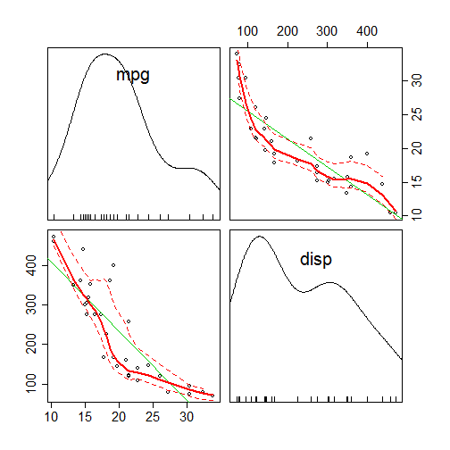

Course Project: Shiny Application and Reproducible Pitch
========================================================
author: Pranay Sarkar
date: 22 Juni 2018


Overview
========================================================

This was built as part of a deliverable for the course **Developing Data Products** as part of the Coursera Data Science Specialization.


Web Application functionality
========================================================

The site is provider for tools to select the most fit car for your trip.

You are required to provide your trip detail like distance of your trip and the price of gasoline in your region in the input section. It is needed to calculate the gasoline expenditure for each car. Next, provide your budget on gasoline, so that the system can filter and show the car with has Miles per Gallon(MPG) that below your budget.

You can choose your desire cars characteristic in term of : Cylinders, Displacement, Horse Power and Transmission. 

The result contains filters selected cars will show in a table on the main content with using the mtcars dataset from [R].


MTCARS Dataset
========================================================

The data used in the app comes from the Motor Trend Car Road Tests (mtcars) dataset. Let has a look on the mtcars's summary

```
      mpg             cyl             disp             hp       
 Min.   :10.40   Min.   :4.000   Min.   : 71.1   Min.   : 52.0  
 1st Qu.:15.43   1st Qu.:4.000   1st Qu.:120.8   1st Qu.: 96.5  
 Median :19.20   Median :6.000   Median :196.3   Median :123.0  
 Mean   :20.09   Mean   :6.188   Mean   :230.7   Mean   :146.7  
 3rd Qu.:22.80   3rd Qu.:8.000   3rd Qu.:326.0   3rd Qu.:180.0  
 Max.   :33.90   Max.   :8.000   Max.   :472.0   Max.   :335.0  
      drat             wt             qsec             vs        
 Min.   :2.760   Min.   :1.513   Min.   :14.50   Min.   :0.0000  
 1st Qu.:3.080   1st Qu.:2.581   1st Qu.:16.89   1st Qu.:0.0000  
 Median :3.695   Median :3.325   Median :17.71   Median :0.0000  
 Mean   :3.597   Mean   :3.217   Mean   :17.85   Mean   :0.4375  
 3rd Qu.:3.920   3rd Qu.:3.610   3rd Qu.:18.90   3rd Qu.:1.0000  
 Max.   :4.930   Max.   :5.424   Max.   :22.90   Max.   :1.0000  
       am              gear            carb      
 Min.   :0.0000   Min.   :3.000   Min.   :1.000  
 1st Qu.:0.0000   1st Qu.:3.000   1st Qu.:2.000  
 Median :0.0000   Median :4.000   Median :2.000  
 Mean   :0.4062   Mean   :3.688   Mean   :2.812  
 3rd Qu.:1.0000   3rd Qu.:4.000   3rd Qu.:4.000  
 Max.   :1.0000   Max.   :5.000   Max.   :8.000  
```


Plot
========================================================

The relationship between miles per gallon (mpg) and displacement (disp) in the mtcars dataset.



